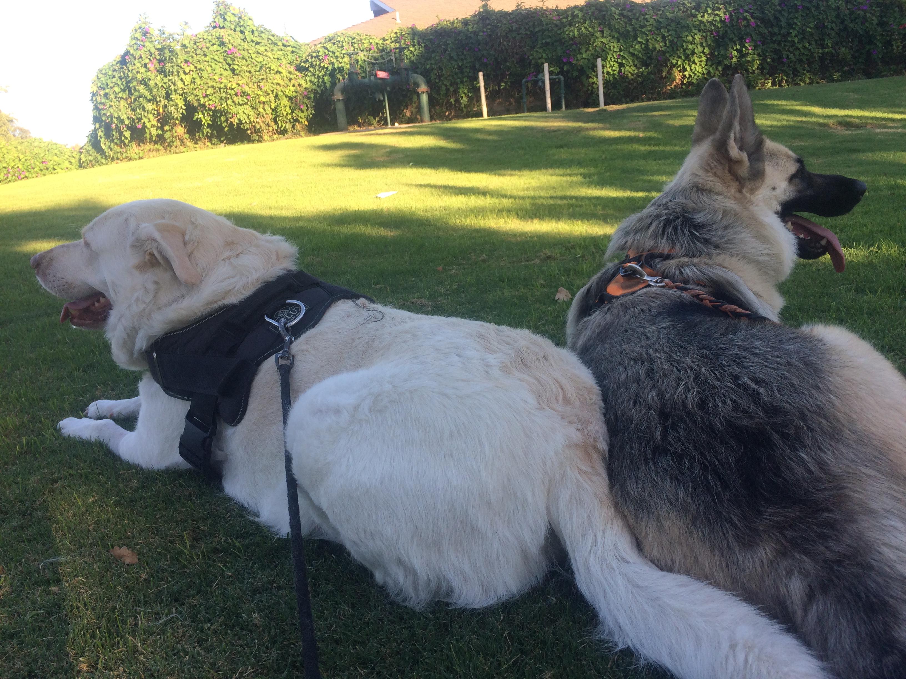
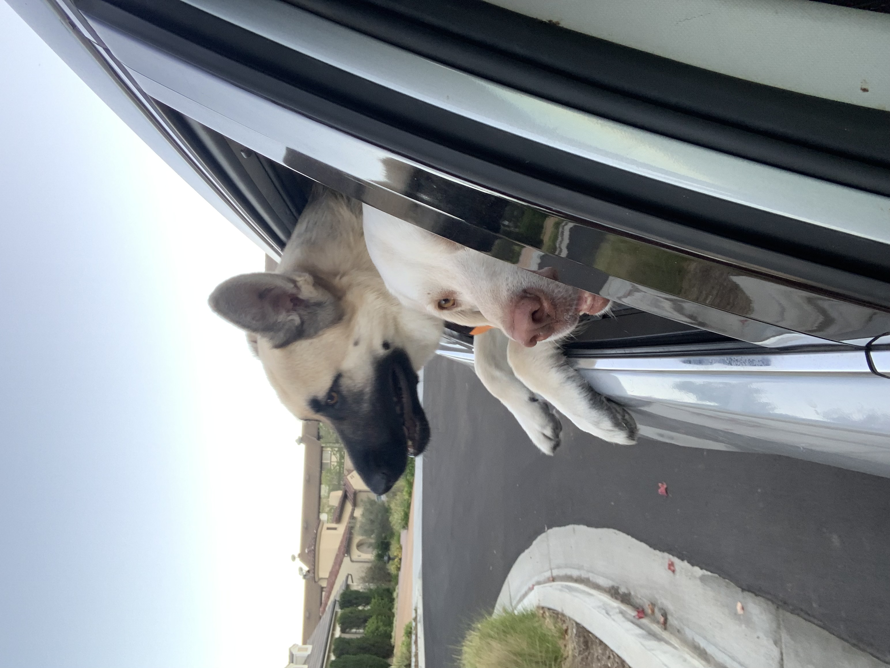
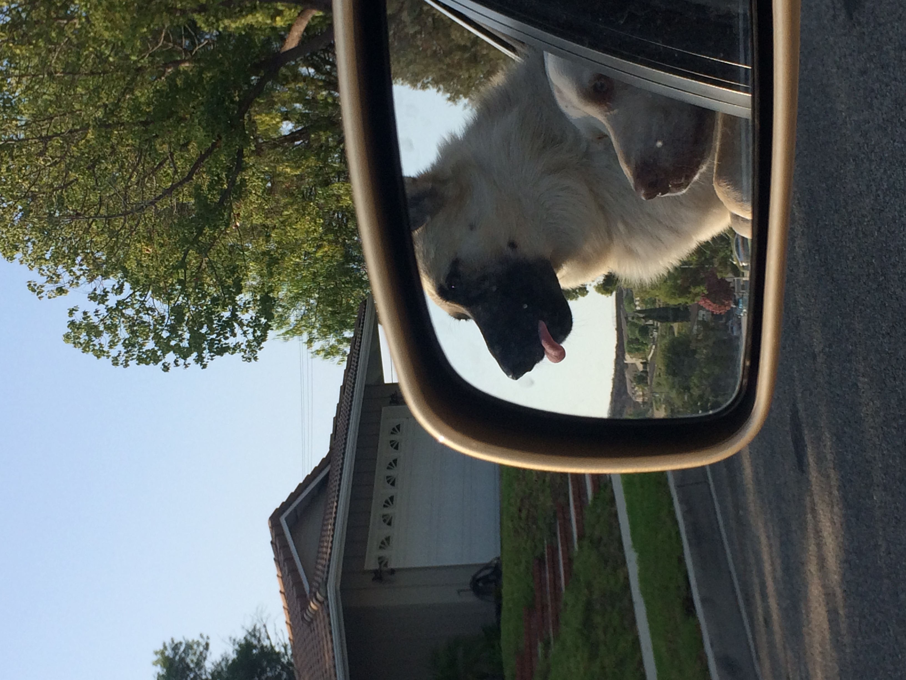

# Hello, my name is Yash.

___

## Me as a Person:


#### Some Random Facts About Me:
* I am an introvert when surrounded by extroverts and an extrovert when surrounded by introverts.
* I am bilingual - Hindi, Marathi, English, and Spanish (**very little**).
  * **Note to self:** _Look up if coding languages qualify as languages for bilingual status._
* I love dogs. I have two, a labrador named Polo (_looks like a polar bear_) and german shepherd named Doby (_looks like Doby from Harry Potter_).

 



My dad loves to refer to them as 
> "his crazy babies."

I am just glad he quit calling me and my brother that ever since we got Polo and Doby. 

#### Some Personal Goals of Mine (most important to least)

1. Become and stay healthy and fit
2. Secure a good internship to avoid stress
3. Learn how to cook good meals
4. ~~Lists are always better with only 3 Items~~

---

## Me as a Programmer:

Over the years, I have become a lot better at ~~procrastinating~~ coding. 

Personally, my current favorite language to use is Python. If you want to learn it, refer to [this](https://docs.python.org/3/ "Solution to your problems!").

The reason why I love Python is

```python
    print("Hello World!)
```

That's all you need to print a line. You don't need

```java
    System.out.println("Hello World");
````

or 

```c++
    cout << "Hello World";
```

We want to print "Hello World,"so we simply call the **print()** method!.

#### My Goals as a Programmer:


* [ ] Secure an internship
* [ ] Work on a cool new project
* [ ] Do well in CSE 110
* [x] ~~No need for a fourth thing once again.~~

---

##### References:

[ReadMe for your reading purposes!](README.md)

[My Dogs 1](Polo-Doby.JPG)

[My Dogs 2](Polo-Doby1.JPG)

[My Dogs 3](Polo-Doby2.jpg)


##### Table of Contents to go back to a Section:
- [Hello, my name is Yash.](#hello-my-name-is-yash)
  - [Me as a Person:](#me-as-a-person)
      - [Some Random Facts About Me:](#some-random-facts-about-me)
      - [Some Personal Goals of Mine (most important to least)](#some-personal-goals-of-mine-most-important-to-least)
  - [Me as a Programmer:](#me-as-a-programmer)
      - [My Goals as a Programmer:](#my-goals-as-a-programmer)
        - [References:](#references)
        - [Table of Contents to go back to a Section:](#table-of-contents-to-go-back-to-a-section)